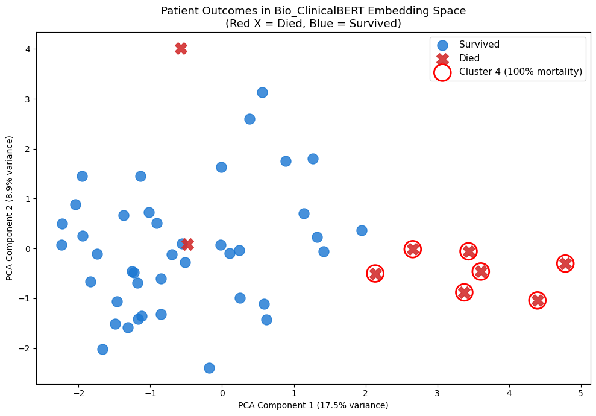
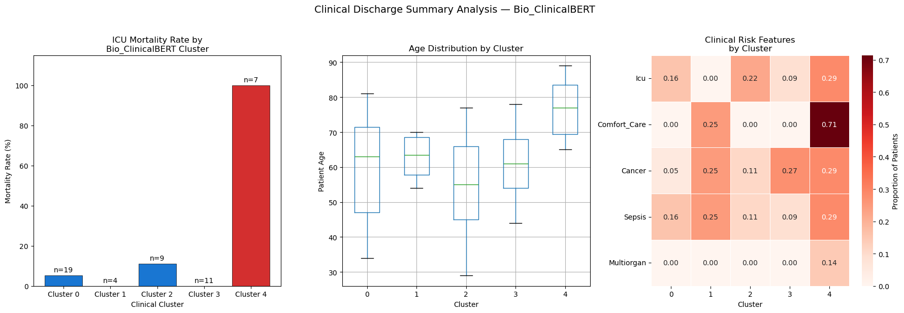

# Clinical Discharge Summary Analyzer
## Bio_ClinicalBERT + Unsupervised Mortality Risk Clustering

## Overview
An NLP pipeline that applies Bio_ClinicalBERT — a transformer model pretrained on clinical notes from MIMIC-III — to analyze discharge summaries and identify patient clusters with distinct mortality profiles. The model identifies mortality-predictive language patterns purely from unstructured clinical text, without using explicit risk scores or structured clinical variables.

## Key Finding
Bio_ClinicalBERT successfully identified a high-mortality patient cluster (Cluster 4) with 100% mortality rate and average age 76.7, dominated by multiorgan failure, end-stage malignancy, and refractory septic shock cases. A distinct low-risk cluster (Cluster 3) showed 0% mortality with average age 60.7. This separation emerged purely from semantic embeddings of clinical language — demonstrating that how physicians write about patients contains strong mortality signal.

## Clinical Context
Early identification of high-risk ICU patients from clinical documentation supports resource allocation, care escalation, and goals-of-care 
conversations. This project operationalizes that problem using transformer-based document embeddings rather than structured clinical variables alone.

## Methodology
### 1. Clinical Text Feature Extraction
- Regex-based section parsing to extract age, gender, primary diagnosis, and clinical risk flags (sepsis, cancer, ICU admission, comfort care, multiorgan failure)
- Medication complexity scoring as proxy for case severity
- Note length as indicator of clinical complexity

### 2. Bio_ClinicalBERT Embeddings
- Loaded emilyalsentzer/Bio_ClinicalBERT pretrained on MIMIC-III clinical notes
- Generated 768-dimensional CLS token embeddings for each discharge summary
- Embeddings capture semantic clinical meaning beyond keyword matching

### 3. Dimensionality Reduction
- Applied PCA to reduce 768 dimensions to 2 for visualization
- 26.42% variance explained by first two components

### 4. Unsupervised Clustering
- KMeans clustering (k=5) on full 768-dimensional embedding space
- Cluster composition analyzed against mortality outcomes

## Results
| Cluster | Patients | Mortality Rate | Avg Age | Dominant Categories |
|---|---|---|---|---|
| 0 | 19 | 5.26% | 60.1 | Renal, Endocrine, Sepsis |
| 1 | 4 | 0.00% | 62.8 | Mixed low acuity |
| 2 | 9 | 11.11% | 54.7 | Respiratory, Neurological |
| 3 | 11 | 0.00% | 60.7 | GI, Cardiac, Oncology |
| 4 | 7 | 100.00% | 76.7 | High Mortality, Neurological |

Overall mortality rate: 18%
Total patients: 50

## Visualizations

### Patient Outcomes in Embedding Space

### Mortality Analysis

## Relevance To Clinical AI
This project directly mirrors production clinical NLP workflows at health AI companies — specifically document processing, unstructured text 
extraction, and LLM-based pattern identification applied to real clinical scenarios. The Bio_ClinicalBERT model used here is the same architecture underlying many clinical NLP systems in active deployment.

## Tech Stack
Python, HuggingFace Transformers, Bio_ClinicalBERT, PyTorch, 
Scikit-learn, Pandas, NumPy, Matplotlib, Seaborn, Jupyter

## How To Run
pip install transformers torch scikit-learn pandas numpy 
            matplotlib seaborn jupyter

Open clinical_discharge_analyzer.ipynb and run all cells.

## Connection To My Research
This project extends my undergraduate research at UCLA Health Radiation Oncology, where I build quantitative predictive models using high-dimensional clinical datasets. The NLP approach here adds a language modeling layer to the structured data ML pipeline developed in my 
MIMIC-III mortality prediction project.

## Next Steps
- Apply to full MIMIC-III NOTEEVENTS table (2M+ real clinical notes) once credentialing is complete
- Fine-tune Bio_ClinicalBERT on mortality prediction as supervised task
- Extend to radiotherapy clinical notes for oncology-specific analysis
